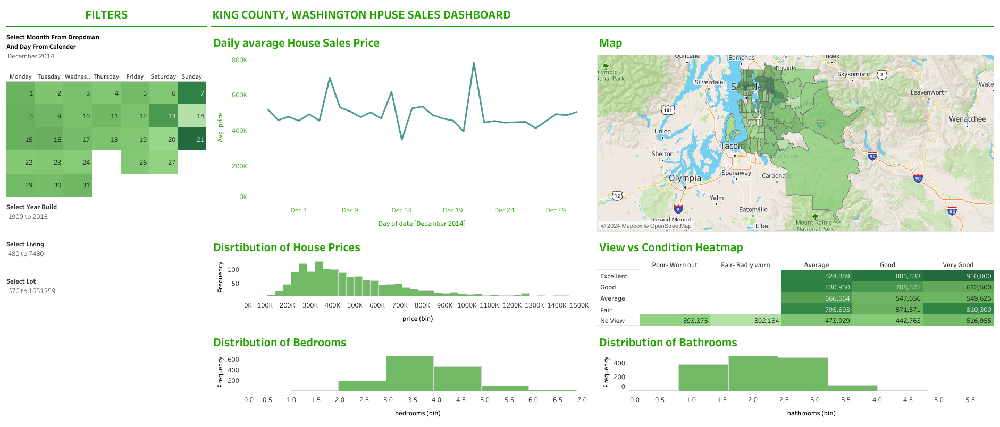
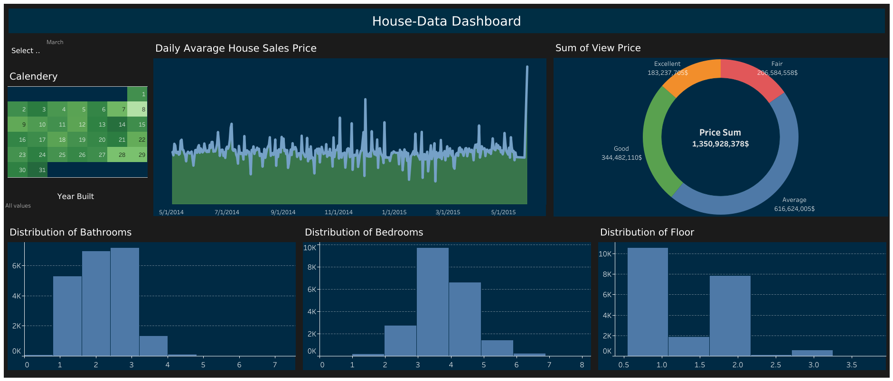

# Мои Tableau Дашборды

Добро пожаловать в мой репозиторий с дашбордами, где вы можете взглянуть на интересные данные и визуализации. Эти дашборды созданы с использованием Tableau.

## Обзор дашбордов

## Ссылки на дашборды

[Washington_dashboard](https://public.tableau.com/views/WashingtonDashboard_17024492199060/Dashboard?:language=en-US&:sid=&:display_count=n&:origin=viz_share_link) |
[HouseData](https://public.tableau.com/views/HouseDataBlack-Blue/Dashboard?:language=en-US&:sid=&:display_count=n&:origin=viz_share_link)

## Как использовать

1. 🌐 Откройте дашборд в своем веб-браузере.
2. 🧐 Исследуйте различные вкладки и интерактивные элементы.
3. 📊 Получите уникальные инсайты из предоставленных данных.

Спасибо за посещение! 🚀
